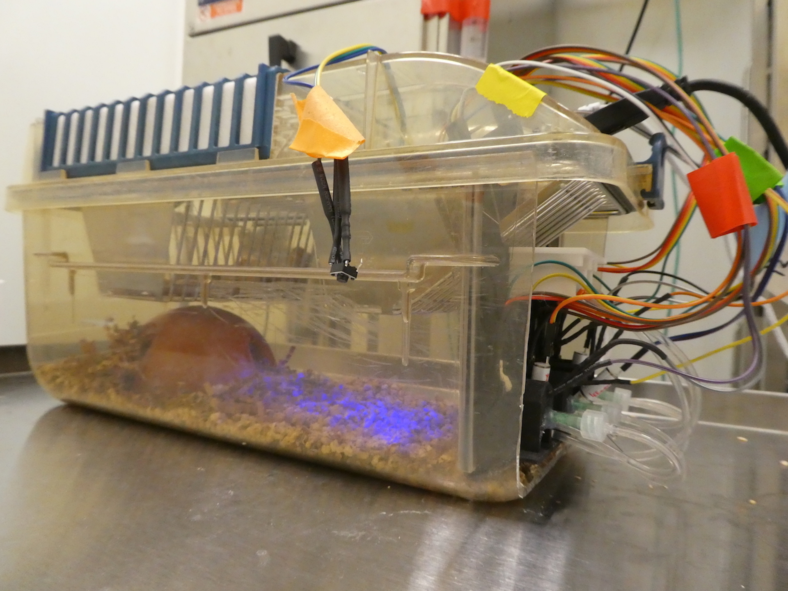
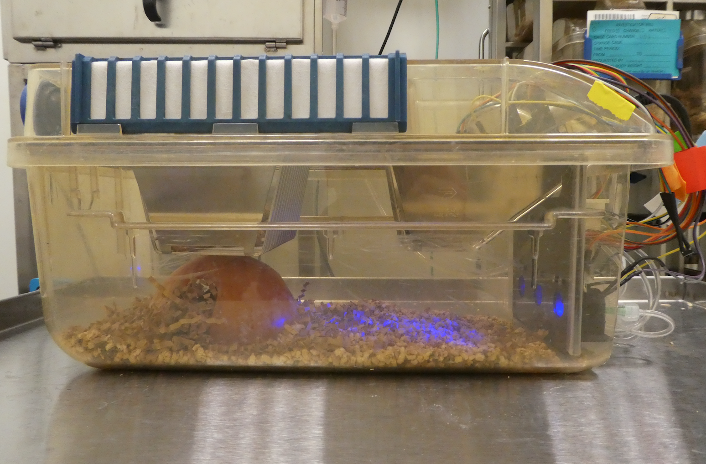
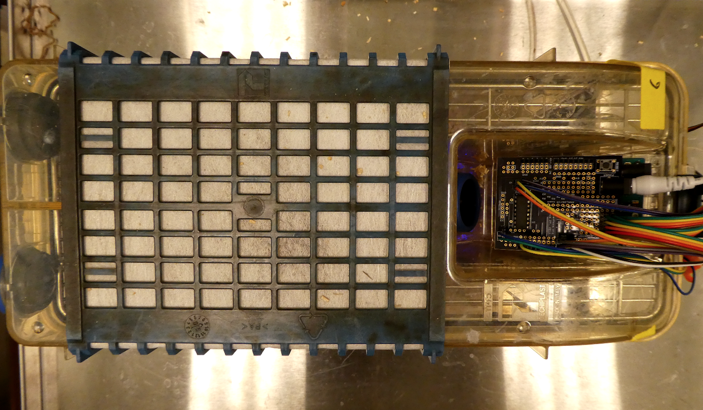

# Arduino Intelligent Modules (AIM) for Behavioral Neuroscientists

     
    <b><i>Figure 1:</b> Mouse interacting with the AIM box - Currently retrieving water reward from the middle port.</i>

   
    <b><i>Figure 2:</b> Diagonal View of AIM</i>

   
    <b><i>Figure 3:</b> Side View of AIM</i>

   
    <b><i>Figure 4:</b> Top View of AIM</i>

   

**Figure 5:** *AIM boxes in operation within our lab satellite room. Data is collected automatically by Processing software to a computer in the next room.*
___

### What is AIM?

AIM is a customizable, low-cost operant box to train and test various paradigms in mice. Made with Arduino microprocessor, 3D printed parts, and various *off-the-shelf* components. Enables 24-hour data collection, significantly reducing total experiment duration from months to a couple weeks, thus facilitating controlled studies on adolescent mice and revealing high temporal resolution data on mice behavior.

Most importantly, this is an open-source project - any contributions / suggestions / feedback are welcome and appreciated!

### Hardware Documentations

The purpose of this repository is to provide **hardware manuals and documentations** for anyone who would like to build their own AIM for use in behavioral neuroscience research. This manual is intended for behavioral neuroscientists without previous experience in engineering or computer science. Therefore the manuals sometimes include explanations on the inner workings of major components used in AIM.

AIM is divided into three different repositories. This repository contains the **hardware** build instructions for AIM. The [second repository](https://github.com/jhl0204/DNAMIC_Arduino_Software_Programs) contains the corresponding **behavioral paradigms** for AIM. The [last repository](https://github.com/jhl0204/DNAMIC_Data_Analysis) contains Python codes for **data analysis** of the behavioral output. Data analysis code is currently in development to create a python package.

The below chapters are rendered via the [Jupyter nbviewer](https://nbviewer.ipython.org/) and is read-only.

#### Contents

* [**Chapter 0 - Introduction**](aa) Why we need Arduino Intelligent Modules (AIM)
* [**Chapter 1 - Getting Started: Essential Tips and Tricks:**](aa)
* [**Chapter 2 - Modifying the Rodent Cage**](aa)
* [**Chapter 3 - Noseports and Plexiglass**](aa) Design files and the philosophy behind the designs
* [**Chapter 4 - OM1 Shield**](aa) Expanding the functionalities of Arduino UNO
* [**Chapter 5 - Component Assembly: LED**](aa)
* [**Chapter 6 - Component Assembly: Infrared Detectors**](aa)
* [**Chapter 7 - Component Assembly: Solenoid Valves**](aa)
* [**Chapter 8 - Component Assembly: Reward Spout**](aa)
* [**Chapter 9 - Component Assembly: Pushbuttons**](aa)
* [**Chapter 10 - Wiring and Soldering**](aa)

* [**Appendix - Bill of Materials**](aa)  (wiki)

### Other open-source projects in the behavioral neuroscience community

1. [Feeding Experimentation Device (FED) - Kravitz Lab](https://github.com/KravitzLab/FED)
2. [CombiCage - Loos Lab](https://www.ncbi.nlm.nih.gov/pmc/articles/PMC5309744/)
3. [ArControl - Li Lab](https://github.com/chenxinfeng4/ArControl)
4. [Openmaze.org](http://openmaze.org/) - open source hardware and software for behavioral neuroscience
5. [Openbehavior.com](http://openbehavior.com/) - repository of open source tools for advancing behavioral neuroscience research]

### Development
_____

##### What to Contribute

- Inaccurate / incorrect information regarding components or explanations
- Typos or grammar mistakes
- Component suggestions
- Your own tips, tricks, and experiences for any hardware projects.

- If you decide to make AIMs yourself, send us photos and any hacks/design modifications that you made! We would love to see how this project expands!

Feel free to open an issue or submit a pull request. All contributions are welcome! - there is no minor contribution. If you're unfamiliar with pull request workflow, feel free to email me with your contributions to jun.ho.lee@dartmouth.edu.

### Contributions and Thanks
_____

A big thanks to **Andrew R. Alvarenga** for his generous support and suggestions regarding hardware. Thank you for also allowing me to use the machine shop and test out different prototypes of the 3D printed parts on the 3D printer.

Thank you to undergraduate researchers **Bonnie Shea** and **Selin Capan** for assisting with daily running of the code.

#### Contact

For any questions or issues, contact the main author, **Jun Ho Lee** at jun.ho.lee@dartmouth.edu or the corresponding author **Katherine Nautiyal** at katherine.nautiyal@dartmouth.edu.
