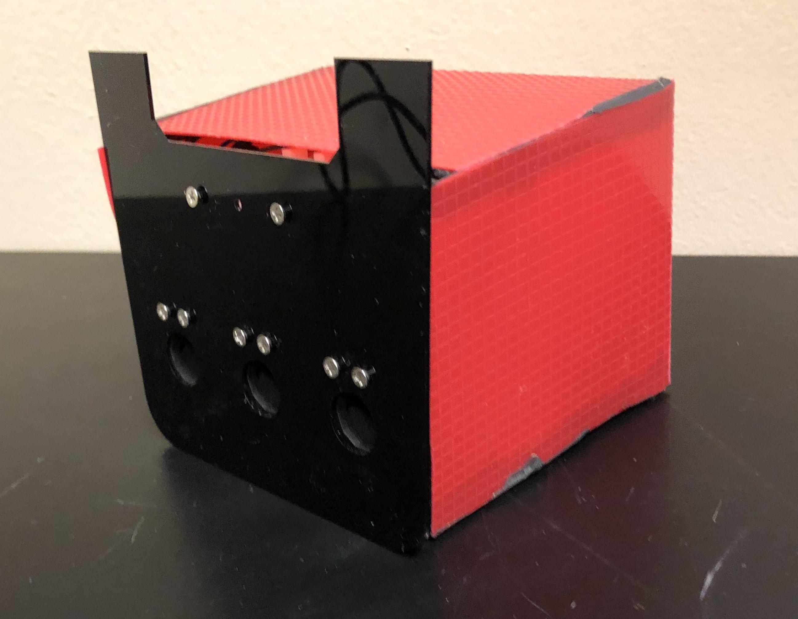
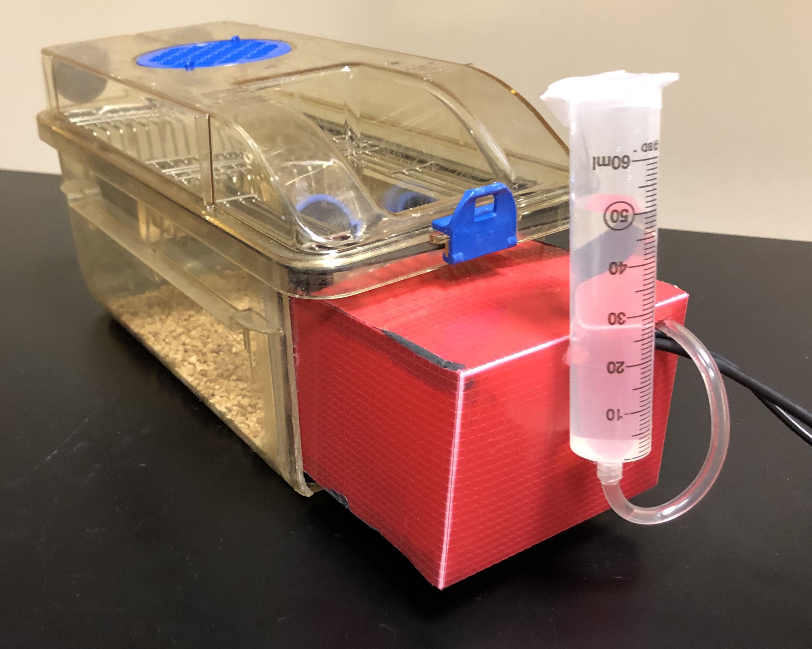
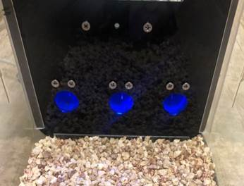
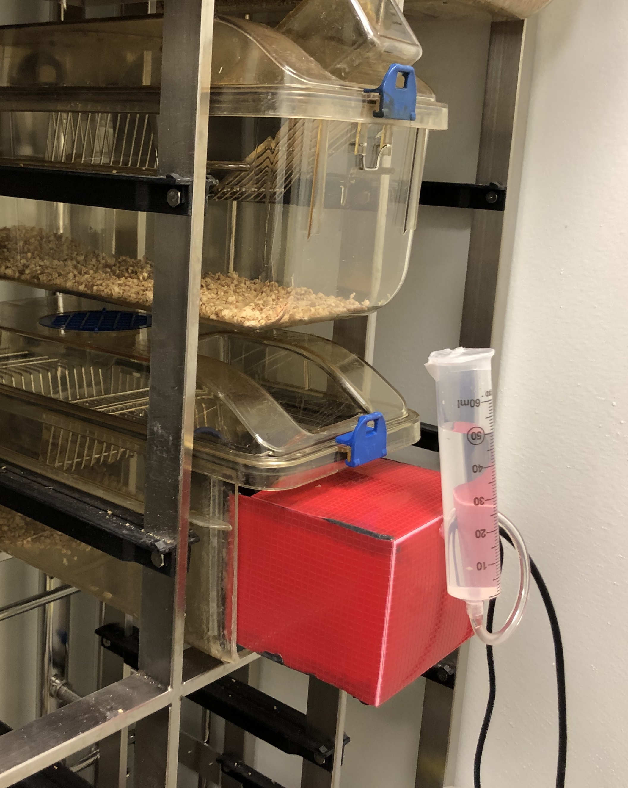

# DIY-Nautiyal Arduino Modular Instrumental Conditioning (DIY-NAMIC) Boxes

     
    <i> Mouse retrieving water reward during behavioral testing in the DIY-NAMIC system </i>

   
    <b><i> Assembled DIY-NAMIC hardware </b> </i>
     
     

   
    <b><i> DIY-NAMIC cage </b></i>

   
    <b><i> Mouse perspective </b> </i>
     
     

   
    <b><i> DIY-NAMIC testing is compatible with ventilated high-density racked cages </b> </i>
     
     

___

### What is DIY-NAMIC?

The DIY-NAMIC box is a customizable, low-cost apparatus for automated homecage operant behavioral testing. Made with Arduino microprocessor, 3D printed parts, and various *off-the-shelf* components, the boxes enable 24-hour data collection, significantly increasing trials/day without food or water restriction, and allowing for self-initiated trials during rodent's dark/active phase.  

Most importantly, this is an open-source project - any contributions / suggestions / feedback are welcome and appreciated!

___
### Benefits of DIY-NAMIC boxes.

1. Decreased Experiment Length  
Rodents have 24 hour access self-initiated trials allowing hundreds of trials per day. This allows for faster testing, reducing the number of days that many standard operant paradigms typically takes to run. This also permits testing during developmental time periods which can be very limited in rodents.

2. Inexpensive compared to commercially available operant testing chambers  
All the materials used to make one DIY-NAMIC box cost around $200, compared to$4000-$10,000 for the commercially-available units, which have limited customizability.

3. No food or water restriction  
Mice consume their normal daily intake of water, and no food deprivation is required.  The sated condition is important for the interpretation of many behavioral effects.  Additionally, this allows testing during development when food/water deprivation can be deleterious to growth.

4. Reduced daily experimenter effort  
There is minimal daily effort required from the experimenter, since mice are living in their homecage, and data is logged in realtime.

5. More ethologically-relevant testing  
Through self-initiated trials, mice can perform during their standard dark/active phase of the light-dark cycle. 

___
### Overview

The purpose of this repository is to provide **hardware manuals, documentation, and code** for anyone who would like to use and/or modify the DIY-NAMIC system.

#### Contents

* [**Chapter 0 - Background and Introduction**](https://github.com/DIY-NAMICsystem/Hardware_Documentation/tree/master/Chapter_0.Background_and_Introduction) 
* [**Chapter 1 - Getting Started - Essential Tips and Tricks**](https://github.com/DIY-NAMICsystem/Hardware_Documentation/tree/master/Chapter_1.Getting_Started-Essential_Tips_and_Tricks)
* [**Chapter 2 - Modifying the Rodent Cage**](https://github.com/DIY-NAMICsystem/Hardware_Documentation/tree/master/Chapter_2.Modifying_Rodent_Cage)
* [**Chapter 3 - OM1 Shield**](https://github.com/DIY-NAMICsystem/Hardware_Documentation/tree/master/Chapter_3.OM1_Shield)
* [**Chapter 4 - Component Assembly - LED**](https://github.com/DIY-NAMICsystem/Hardware_Documentation/tree/master/Chapter_4.Component_Assembly-LED)
* [**Chapter 5 - Component Assembly - Infrared Detectors**](https://github.com/DIY-NAMICsystem/Hardware_Documentation/tree/master/Chapter_5.Component_Assembly-Infrared_Detectors)
* [**Chapter 6 - Component Assembly - Solenoid Valves**](https://github.com/DIY-NAMICsystem/Hardware_Documentation/tree/master/Chapter_6.Component_Assembly-Solenoid_Valves)
* [**Chapter 7 - Component Assembly - Reward Spout**](https://github.com/DIY-NAMICsystem/Hardware_Documentation/tree/master/Chapter_7.Component_Assembly-Reward_Spout)
* [**Chapter 8 - Wiring and Soldering**](https://github.com/DIY-NAMICsystem/Hardware_Documentation/tree/master/Chapter_8.Wiring_and_Soldering)
* [**Chapter 9 - Final Assembly**](https://github.com/DIY-NAMICsystem/Hardware_Documentation/tree/master/Chapter_9.Final_Assembly)

* [**Appendix - Bill of Materials**](https://github.com/DIY-NAMICsystem/Hardware_Documentation/tree/master/Bill_of_Materials)

____
### Other open-source projects in the behavioral neuroscience community

1. [Feeding Experimentation Device (FED) - Kravitz Lab](https://github.com/KravitzLab/FED)
2. [CombiCage - Loos Lab](https://www.ncbi.nlm.nih.gov/pmc/articles/PMC5309744/)
3. [ArControl - Li Lab](https://github.com/chenxinfeng4/ArControl)
4. [Openmaze.org](http://openmaze.org/) - open source hardware and software for behavioral neuroscience
5. [Openbehavior.com](http://openbehavior.com/) - repository of open source tools for advancing behavioral neuroscience research]

### Development
_____

### Contributions and Thanks
_____

A big thanks to **Andrew R. Alvarenga** for his generous support and suggestions regarding hardware. Thank you for also allowing me to use the machine shop and test out different prototypes of the 3D printed parts on the 3D printer.

Thank you to undergraduate researchers **Bonnie Shea** and **Selin Capan** for assisting with daily running of the code.

#### Contact

For any questions or issues, contact **Jun Ho Lee** at jun.ho.lee@dartmouth.edu or **Katherine Nautiyal** at katherine.nautiyal@dartmouth.edu.
